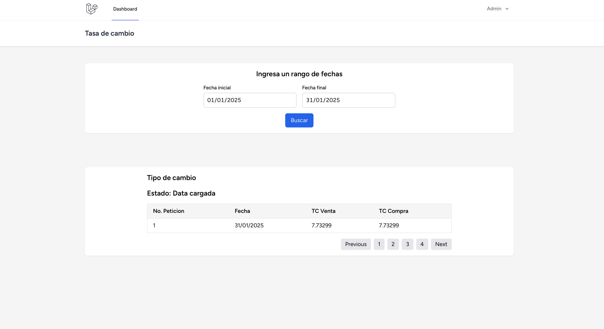
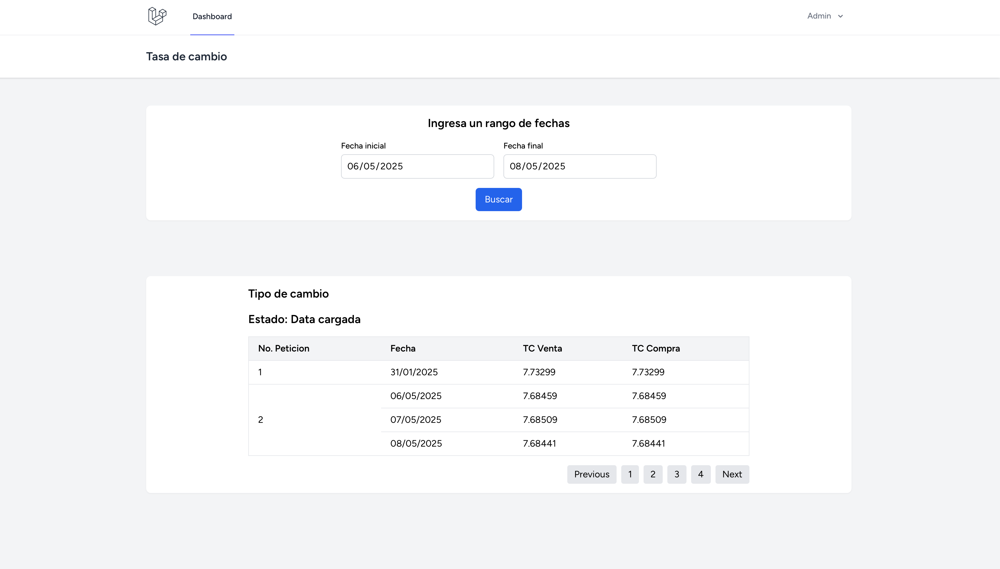
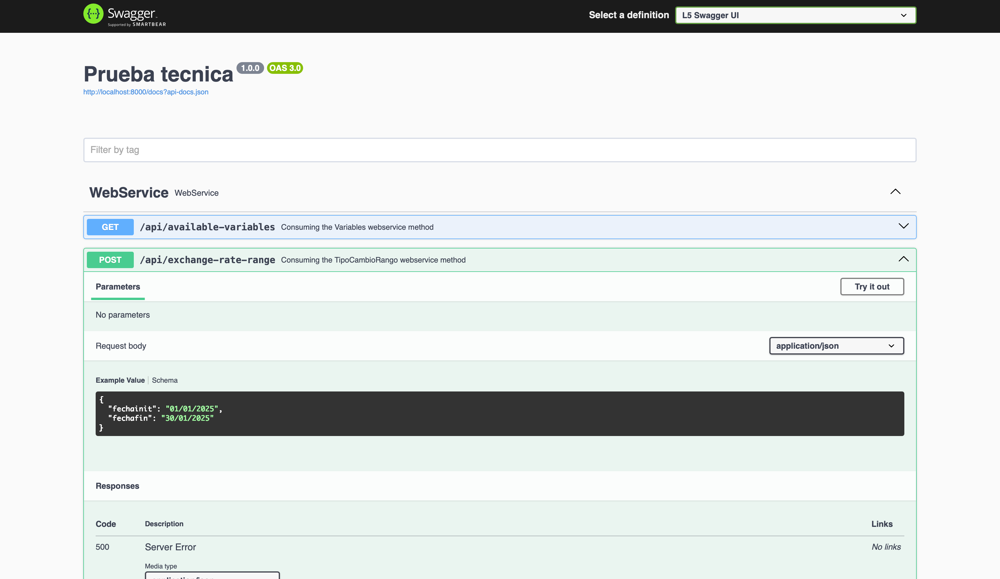

# 📦 Laravel Project

Este proyecto está desarrollado con [Laravel](https://laravel.com/) y proporciona una base sólida para aplicaciones web modernas usando PHP.

## 📋 Requisitos

- PHP >= 8.1
- Composer
- MySQL o PostgreSQL
- Node.js y NPM
- Extensiones PHP requeridas: `openssl`, `pdo`, `mbstring`, `tokenizer`, `xml`, `ctype`, `json`, `bcmath`, `fileinfo`

## 🚀 Instalación

### 1. Clona el repositorio

```bash
git clone https://github.com/tuusuario/tu-repo.git
cd tu-repo


composer install

Copia y configura el archivo de entorno

cp .env.example .env


Modifica las variables necesarias en .env, especialmente las de la base de datos:


DB_CONNECTION=mysql
DB_HOST=127.0.0.1
DB_PORT=3306
DB_DATABASE=nombre_base_de_datos
DB_USERNAME=usuario
DB_PASSWORD=contraseña

Nota: Dejo el script de base datos en la carpeta database, o puedes realizar la migracion el cual crea los esquemas automaticamente.


php artisan key:generate


php artisan serve

Genera la clave de la aplicación

php artisan key:generate

Ejecuta las migraciones
php artisan migrate


levanda un servidor local 

php artisan serve
```


## Para el usuario usa: 
email: admin@admin.com

password: password


pruebas fotografica






para la documentación APIRest engresa la siguiente url

/api/documentation



